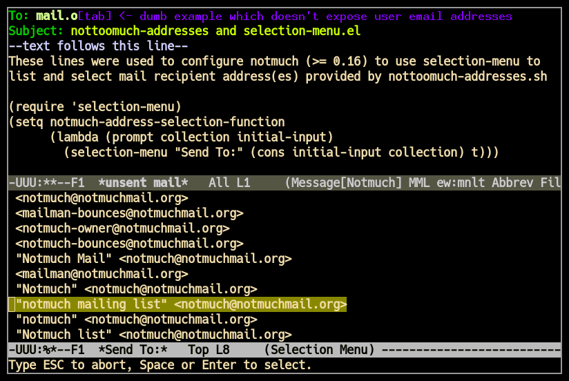

selection-menu.el
=================

`selection-menu.el <selection-menu.el>`_ is an emacs lisp module/function
providing:
::

  (defun selection-menu (ident items &optional unread)
    "Pops up a buffer listing lines given ITEMS one per line.
     Use arrow keys (or C-p/C-n) to select and SPC/RET to select.
     Return to parent buffer when any other key is pressed.
     In this case if optional UNREAD is non-nil return the
     read key back to input queue for parent to consume." ...)

Notmuch-emacs address completion usage
--------------------------------------

With notmuch 0.16 (or newer) adding the following emacs lisp piece
to your notmuch initialization file will make notmuch address completion
feature use selection menu:
::

  (require 'selection-menu)
  (setq notmuch-address-selection-function
        (lambda (prompt collection initial-input)
          (selection-menu "Send To:" (cons initial-input collection) t)))

See also
--------

`nottoomuch-addresses <nottoomuch-addresses.rst>`_

Example picture
---------------

In the illustrated example picture below you can see selection-menu in
action when completing email addresses.

